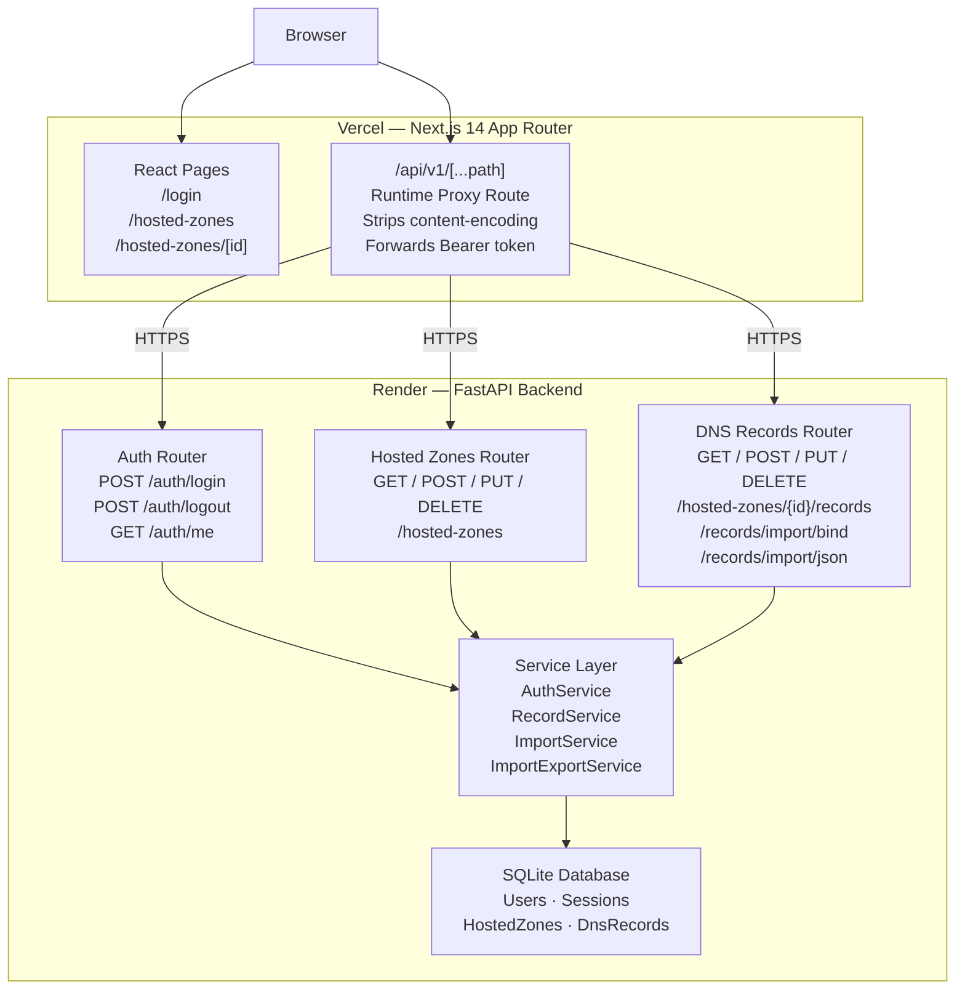
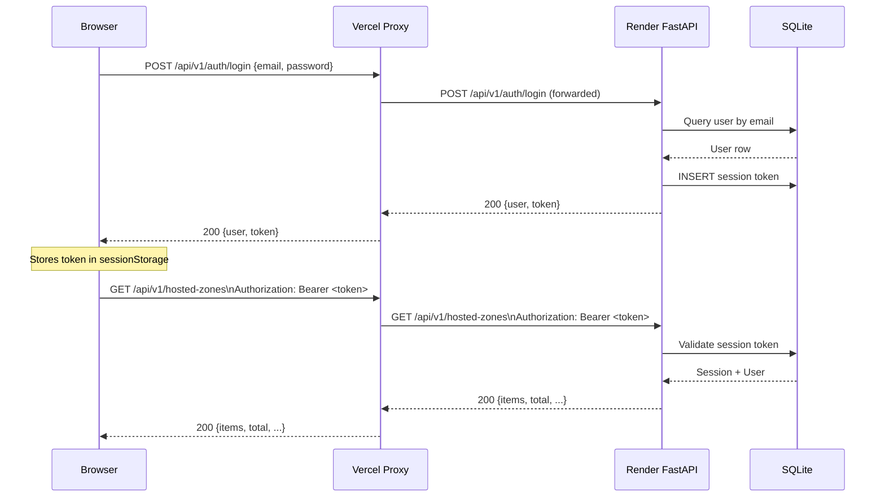

<div align="center">


<h1>AWS Route53 Clone</h1>
<p><strong>A production-grade, pixel-perfect clone of the AWS Route53 Management Console</strong></p>
<p>Built with FastAPI · Next.js 14 · TypeScript · SQLite · Tailwind CSS</p>

<br/>

[](https://aws-route53-clone-three.vercel.app)
[](https://route53-clone-backend-1jhp.onrender.com/docs)

<br/>


</div>

---

## What Is This?

This is a **fully functional DNS management console** that replicates the AWS Route53 experience end-to-end — from the dark navy topbar down to the orange CTAs. It goes far beyond a toy CRUD app:

- **Real backend** — FastAPI with session-based auth, SQLAlchemy ORM, and a production-ready layered service architecture
- **Real frontend** — Next.js App Router, TanStack Query for server-state, Cloudscape-inspired design system
- **Real features** — BIND import/export, dark mode, keyboard shortcuts, bulk operations
- **Real deployment** — Vercel (frontend) + Render (backend) with a runtime proxy to fix cross-domain auth

**Demo:** `admin@example.com` / `password123` — try it at [aws-route53-clone-three.vercel.app](https://aws-route53-clone-three.vercel.app)

---

## System Architecture



---

## Request Flow — Authentication



---

## Feature Highlights

### Hosted Zone Management

| Feature | Details |
|---|---|
| Create / Edit / Delete | Full lifecycle management for public and private zones |
| Auto NS and SOA records | System records auto-generated on creation, protected from deletion |
| Search and Pagination | Real-time domain-name search with configurable page size |
| Multi-select Bulk Delete | Select multiple zones and delete in one action |
| Keyboard shortcut | `n` to create a new zone, `r` to refresh |

### DNS Record Management

| Feature | Details |
|---|---|
| Record types | A, AAAA, CNAME, TXT, MX, NS, PTR, SRV, CAA |
| Full CRUD | Create, view, edit, and delete any record |
| Type filter | Filter records by type with a single click |
| Import | Upload BIND zone files or paste JSON arrays |
| Export | Download as JSON or BIND-compatible zone file |
| Bulk delete | Multi-select and delete records in one click |
| Keyboard shortcuts | `c` to create, `i` to import, `r` to refresh |

### Authentication

- Session-based auth with `bcrypt` password hashing (pinned to 3.2.2 for passlib compatibility)
- Bearer token forwarded through the Next.js proxy (solves cross-domain Vercel to Render auth)
- Client-side auth guard with automatic redirect to `/login`
- Session persistence via `sessionStorage`

### Dark Mode

- Toggle between light and dark with the button in the topbar
- Preference persisted to `localStorage`
- Full dark-mode CSS coverage for every component

### Keyboard Shortcuts

| Key | Action |
|---|---|
| `?` | Open shortcuts help panel |
| `n` | New hosted zone |
| `c` | New DNS record |
| `i` | Import DNS records |
| `r` | Refresh current table |
| `Esc` | Close any open modal |

Shortcuts are automatically disabled while typing in an input field or when any modal is open.

---

## Tech Stack

| Layer | Technology | Purpose |
|---|---|---|
| Frontend | Next.js 14 App Router | Pages, routing, server components |
| Styling | Tailwind CSS + custom CSS | Cloudscape-inspired AWS design system |
| State | TanStack Query v5 | Server-state caching and mutations |
| Backend | FastAPI + Uvicorn | REST API with async routing |
| ORM | SQLAlchemy 2 + Pydantic v2 | Models, validation, serialization |
| Database | SQLite | Zero-config persistent storage |
| Auth | bcrypt + Bearer tokens | Password hashing + cross-domain sessions |
| Deployment | Vercel + Render | Frontend CDN + backend hosting |

---

## Quick Start (Local)

### Prerequisites

- Python 3.12+
- Node.js 20+

### 1. Clone the repo

```bash
git clone https://github.com/BugHunterX2101/AWS_Route53_Clone.git
cd AWS_Route53_Clone
```

### 2. Start the backend

```bash
cd backend
python -m venv venv
.\venv\Scripts\activate        # Windows
# source venv/bin/activate     # macOS/Linux
pip install -r requirements.txt
uvicorn app.main:app --reload --port 8000
```

The backend seeds a demo user and sample zones automatically on first launch.

### 3. Start the frontend

```bash
cd frontend
npm install
npm run dev
```

Open [http://localhost:3000](http://localhost:3000) and sign in with `admin@example.com` / `password123`

### 4. API Documentation

- **Swagger UI:** [http://localhost:8000/docs](http://localhost:8000/docs)
- **ReDoc:** [http://localhost:8000/redoc](http://localhost:8000/redoc)

---

## Deploy Your Own (Free)

### Frontend — Vercel

1. Import the repo at [vercel.com/new](https://vercel.com/new)
2. Set **Root Directory** to `frontend`
3. Add environment variable: `BACKEND_URL=https://your-render-backend.onrender.com`
4. Deploy

### Backend — Render

1. Go to [render.com](https://render.com) and create a **New Web Service**
2. Connect `BugHunterX2101/AWS_Route53_Clone`
3. Set **Root Directory** to `backend`
4. Build command: `pip install -r requirements.txt`
5. Start command: `uvicorn app.main:app --host 0.0.0.0 --port $PORT`
6. Add environment variable: `DATABASE_URL=sqlite:///./route53_clone.db`

> **Note:** Render free tier spins down after 15 minutes of inactivity. The first request after sleep takes up to 30 seconds — the login page displays a "Server waking up..." message automatically.

---

## Project Structure

```
AWS Route53 Clone/
├── render.yaml                         # Render Blueprint
├── backend/
│   ├── requirements.txt
│   └── app/
│       ├── main.py                     # FastAPI app entry point + CORS middleware
│       ├── seed.py                     # Demo user and sample data seeder
│       ├── api/
│       │   ├── deps.py                 # Auth dependency (Bearer token validation)
│       │   └── v1/
│       │       ├── auth.py             # Login / logout / me
│       │       ├── hosted_zones.py     # Zone CRUD
│       │       └── dns_records.py      # Record CRUD + import endpoints + bulk DELETE
│       ├── core/
│       │   ├── config.py               # Settings via Pydantic BaseSettings
│       │   ├── database.py             # SQLAlchemy engine + session factory
│       │   └── security.py             # bcrypt hashing + session token generation
│       ├── models/                     # SQLAlchemy ORM models
│       ├── schemas/                    # Pydantic v2 request/response schemas
│       └── services/
│           ├── auth_service.py
│           ├── record_service.py
│           ├── import_service.py       # BIND zone file parser
│           └── import_export_service.py
└── frontend/
    ├── app/
    │   ├── layout.tsx                  # Root layout + all context providers
    │   ├── globals.css                 # Design system tokens + dark mode overrides
    │   ├── (auth)/login/               # Login page
    │   ├── (dashboard)/                # Protected dashboard pages
    │   └── api/v1/[...path]/           # Runtime proxy route to Render backend
    ├── components/
    │   ├── layout/                     # TopBar, SideNav, Breadcrumbs
    │   ├── zones/                      # HostedZonesTable, ZoneFormModal, ZoneHeader
    │   ├── records/                    # RecordsTable, RecordFormModal, ImportRecordsModal
    │   └── common/                     # Modal, ConfirmDialog, Pagination, SearchBar, KeyboardShortcutsHelp
    ├── context/
    │   ├── AuthContext.tsx
    │   ├── ThemeContext.tsx             # Dark / light mode with localStorage persistence
    │   ├── ToastContext.tsx
    │   └── KeyboardShortcutsContext.tsx
    ├── lib/
    │   ├── api-client.ts               # Typed fetch wrapper + Bearer token injection
    │   └── query-keys.ts
    └── types/                          # TypeScript interfaces
```

---

## Contributing

Pull requests are welcome. If you find a bug or want to add a feature:

1. Fork the repo
2. Create a feature branch: `git checkout -b feat/my-feature`
3. Commit your changes: `git commit -m "feat: add my feature"`
4. Push and open a pull request

---

## License

MIT — free to use, modify, and distribute.

---

<div align="center">
  <p>Built as a full-stack engineering showcase</p>
  <p>
    <a href="https://aws-route53-clone-three.vercel.app">Live Demo</a> &nbsp;·&nbsp;
    <a href="https://route53-clone-backend-1jhp.onrender.com/docs">API Docs</a> &nbsp;·&nbsp;
    <a href="https://github.com/BugHunterX2101/AWS_Route53_Clone/issues">Report Bug</a>
  </p>
</div>
