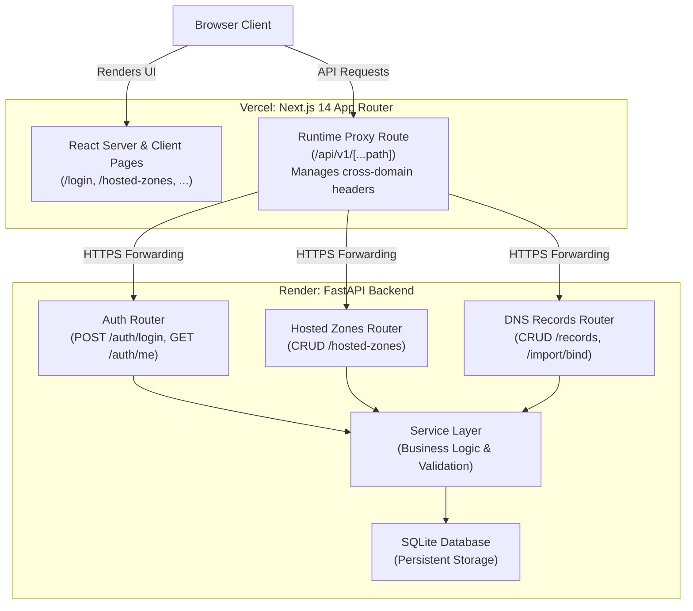
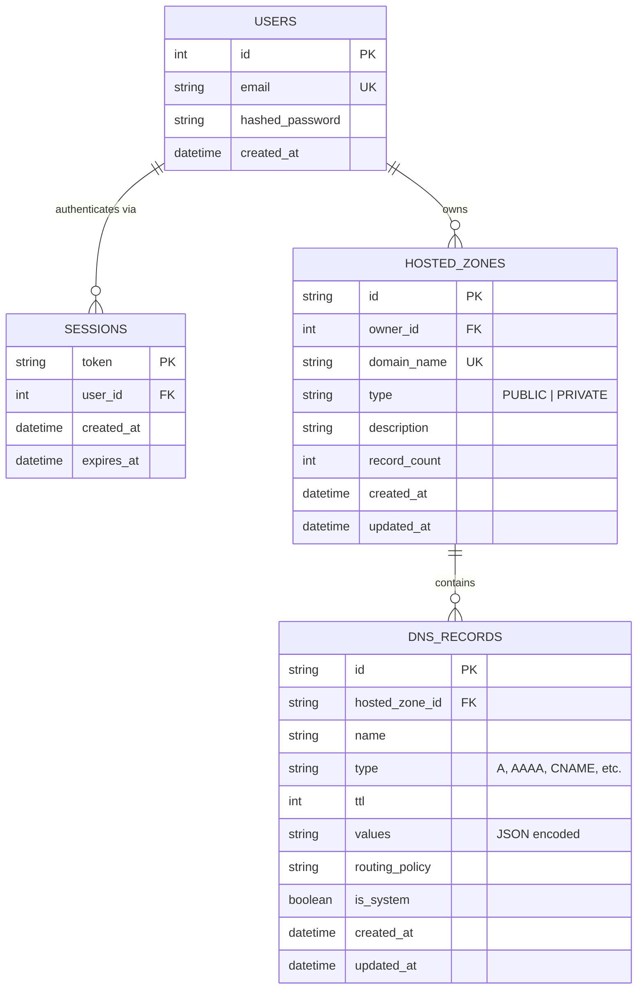
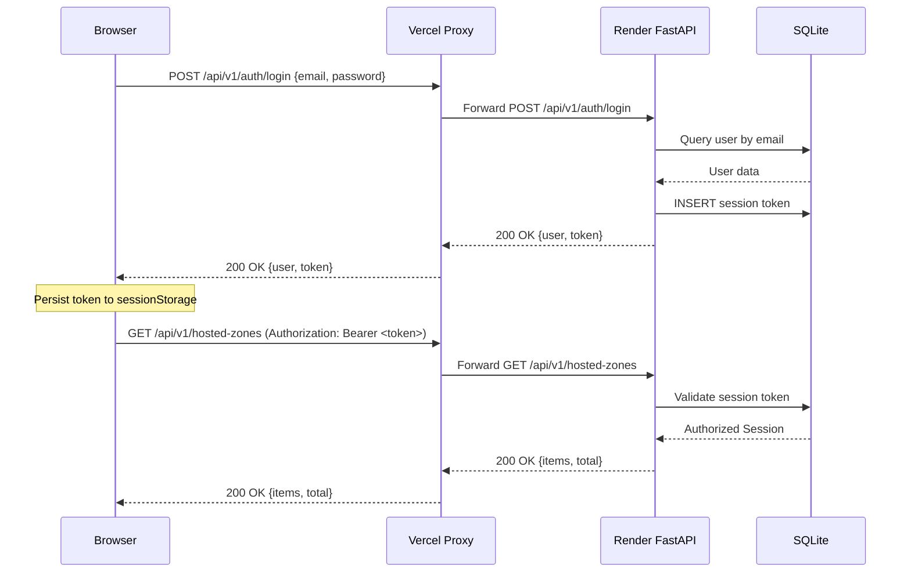

<div align="center">


<h1>AWS Route53 Clone</h1>
<p><strong>A production-grade, highly-accurate clone of the AWS Route53 Management Console</strong></p>
<p>Built with FastAPI · Next.js 14 · TypeScript · SQLite · Tailwind CSS</p>

<br/>

[](https://aws-route53-clone-three.vercel.app)
[](https://route53-clone-backend-1jhp.onrender.com/docs)

<br/>


</div>

---

## Executive Summary

This project delivers a **fully functional DNS management console** that rigorously replicates the AWS Route53 experience. It is designed as a complete full-stack application, prioritizing architectural best practices, performance, and UI/UX fidelity.

- **Robust Backend**: Powered by FastAPI, featuring session-based authentication, SQLAlchemy ORM, and a scalable layered service architecture.
- **Modern Frontend**: Built on the Next.js 14 App Router, utilizing TanStack Query for efficient server-state management and a bespoke Cloudscape-inspired design system.
- **Comprehensive Features**: Supports complex operations including BIND zone file import/export, dark mode toggling, advanced keyboard shortcuts, and bulk record manipulation.
- **Production Deployment**: Frontend hosted on Vercel, backend hosted on Render, seamlessly integrated via a runtime proxy to mitigate cross-domain authentication constraints.

**Live Demonstration:** `admin@example.com` / `password123` — Accessible at [aws-route53-clone-three.vercel.app](https://aws-route53-clone-three.vercel.app)

---

## System Architecture

### High-Level Topology



### Database Schema (ERD)



### Request Flow: Authentication



---

## Core Capabilities

### Hosted Zone Management

| Feature | Details |
|---|---|
| Lifecycle Management | Complete Create, Read, Update, and Delete (CRUD) operations for Public and Private zones. |
| System Record Generation | Automatic provisioning of foundational Name Server (NS) and Start of Authority (SOA) records. |
| Search & Pagination | Real-time domain name filtering with dynamic page sizing. |
| Bulk Operations | Multi-select interface for executing deletion across multiple zones simultaneously. |
| Navigation Shortcuts | Press `n` to instantiate a new zone; press `r` to refresh the table state. |

### DNS Record Management

| Feature | Details |
|---|---|
| Supported Record Types | A, AAAA, CNAME, TXT, MX, NS, PTR, SRV, CAA. |
| Complete CRUD | Full lifecycle management across all record types with granular validation. |
| Dynamic Filtering | One-click filtering by record type. |
| Import / Export Engine | Upload standard BIND zone files or JSON. Export configurations seamlessly. |
| Bulk Actions | Efficient multi-record deletion interface. |
| Interactive Shortcuts | Press `c` to create, `i` to import, and `r` to refresh records. |

### Security & Authentication

- **Session Management**: Secure, stateful sessions utilizing `bcrypt` for password hashing (strictly pinned to version 3.2.2 for `passlib` compatibility).
- **Proxy Architecture**: Bearer tokens are transparently forwarded through the Next.js API proxy to resolve cross-origin resource sharing (CORS) and cross-domain authentication limitations.
- **Client-Side Protection**: Robust authentication guards automatically redirect unauthenticated traffic to the `/login` portal.

### User Interface & Experience

- **Persistent Dark Mode**: Seamless toggle between light and dark themes, with preferences persisted locally.
- **Accessibility & Shortcuts**: Global keyboard shortcuts (accessible via `?`) empower power-users to navigate and execute actions rapidly. Shortcuts are intelligently disabled during input focus.
- **Design Language**: Pixel-perfect adherence to the AWS Cloudscape design system, ensuring a familiar and professional environment.

---

## Technology Stack

| Domain | Technology | Implementation Details |
|---|---|---|
| **Frontend Framework** | Next.js 14 App Router | Handles server-side rendering, routing, and React Server Components. |
| **Styling** | Tailwind CSS | Custom utility classes tailored to replicate AWS design tokens. |
| **State Management** | TanStack Query v5 | Advanced server-state caching, automatic refetching, and mutation handling. |
| **Backend Framework** | FastAPI + Uvicorn | High-performance, asynchronous RESTful API architecture. |
| **Data Access Layer** | SQLAlchemy 2 + Pydantic v2 | Object-relational mapping paired with strict data validation. |
| **Database** | SQLite | Lightweight, persistent relational storage. |
| **Security** | bcrypt | Industry-standard password hashing and secure token generation. |
| **Infrastructure** | Vercel & Render | Distributed hosting for frontend and backend respectively. |

---

## Local Development Guide

### System Requirements

- Python 3.12 or higher
- Node.js 20 or higher

### 1. Repository Initialization

```bash
git clone https://github.com/BugHunterX2101/AWS_Route53_Clone.git
cd AWS_Route53_Clone
```

### 2. Backend Environment Setup

```bash
cd backend
python -m venv venv

# Windows
.\venv\Scripts\activate
# macOS / Linux
# source venv/bin/activate

pip install -r requirements.txt
uvicorn app.main:app --reload --port 8000
```
*Note: The backend automatically seeds a demonstration user and sample zones upon initial execution.*

### 3. Frontend Environment Setup

```bash
cd frontend
npm install
npm run dev
```

Navigate to [http://localhost:3000](http://localhost:3000) and authenticate using `admin@example.com` / `password123`.

### 4. API Documentation Access

- **Swagger UI:** [http://localhost:8000/docs](http://localhost:8000/docs)
- **ReDoc:** [http://localhost:8000/redoc](http://localhost:8000/redoc)

---

## Deployment Configuration

### Frontend Deployment (Vercel)

1. Import the repository via [vercel.com/new](https://vercel.com/new).
2. Configure the **Root Directory** to `frontend`.
3. Inject the required environment variable: `BACKEND_URL=https://<your-render-instance>.onrender.com`.
4. Execute deployment.

### Backend Deployment (Render)

1. Navigate to [render.com](https://render.com) and provision a **New Web Service**.
2. Connect the repository `BugHunterX2101/AWS_Route53_Clone`.
3. Configure the **Root Directory** to `backend`.
4. **Build Command**: `pip install -r requirements.txt`
5. **Start Command**: `uvicorn app.main:app --host 0.0.0.0 --port $PORT`
6. Inject the required environment variable: `DATABASE_URL=sqlite:///./route53_clone.db`

> **Architectural Note:** Render's free tier automatically suspends the instance after 15 minutes of inactivity. Initial requests post-suspension may require up to 30 seconds for the container to initialize. The frontend login interface programmatically detects this and displays a "Server waking up..." status to manage user expectations.

---

## Project Directory Structure

```text
AWS Route53 Clone/
├── render.yaml                         # Infrastructure as Code (Render Blueprint)
├── backend/
│   ├── requirements.txt
│   └── app/
│       ├── main.py                     # FastAPI application root & middleware configuration
│       ├── seed.py                     # Database initialization and seeding logic
│       ├── api/
│       │   ├── deps.py                 # Dependency injection (e.g., Bearer token validation)
│       │   └── v1/
│       │       ├── auth.py             # Authentication endpoints
│       │       ├── hosted_zones.py     # Hosted Zone management endpoints
│       │       └── dns_records.py      # DNS Record management & import/export endpoints
│       ├── core/
│       │   ├── config.py               # Environment configuration via Pydantic BaseSettings
│       │   ├── database.py             # SQLAlchemy engine configuration
│       │   └── security.py             # Cryptography and session generation utilities
│       ├── models/                     # SQLAlchemy declarative models
│       ├── schemas/                    # Pydantic v2 schemas for I/O validation
│       └── services/                   # Business logic layer
│           ├── auth_service.py
│           ├── record_service.py
│           ├── import_service.py
│           └── import_export_service.py
└── frontend/
    ├── app/
    │   ├── layout.tsx                  # Root Next.js layout & context providers
    │   ├── globals.css                 # Global stylesheets & dark mode tokens
    │   ├── (auth)/login/               # Authentication views
    │   ├── (dashboard)/                # Protected application views
    │   └── api/v1/[...path]/           # Serverless proxy route to the backend
    ├── components/
    │   ├── layout/                     # Structural components (TopBar, SideNav)
    │   ├── zones/                      # Zone-specific interfaces
    │   ├── records/                    # Record-specific interfaces & Modals
    │   └── common/                     # Reusable UI primitives (Modals, Pagination)
    ├── context/                        # React Context providers (Auth, Theme, Toast)
    ├── lib/
    │   ├── api-client.ts               # Type-safe fetch wrapper with interceptor logic
    │   └── query-keys.ts               # TanStack Query cache key definitions
    └── types/                          # Global TypeScript definitions
```

---

## Contribution Guidelines

Contributions are encouraged to improve the architecture or expand the feature set. 

1. Fork the repository.
2. Branch off for your feature: `git checkout -b feat/your-feature-name`.
3. Commit your changes utilizing conventional commits: `git commit -m "feat: implement your feature"`.
4. Push to your fork and submit a Pull Request.

---

## Licensing

Distributed under the MIT License. Free for commercial and non-commercial utilization.

---

<div align="center">
  <p>Engineered as a comprehensive full-stack technical showcase.</p>
  <p>
    <a href="https://aws-route53-clone-three.vercel.app">Live Demonstration</a> &nbsp;·&nbsp;
    <a href="https://route53-clone-backend-1jhp.onrender.com/docs">API Documentation</a> &nbsp;·&nbsp;
    <a href="https://github.com/BugHunterX2101/AWS_Route53_Clone/issues">Report an Issue</a>
  </p>
</div>
