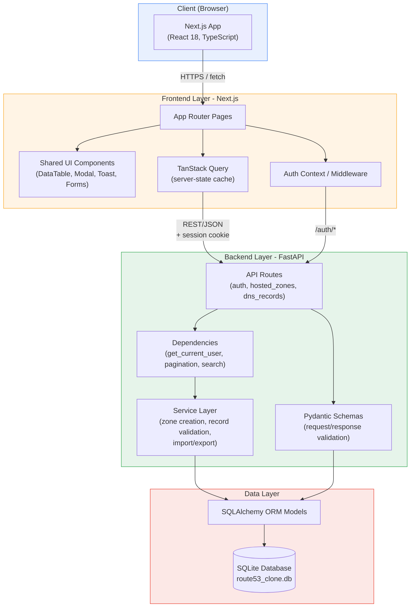
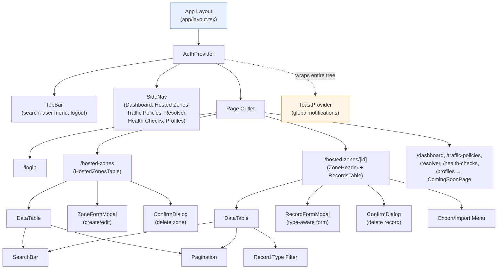
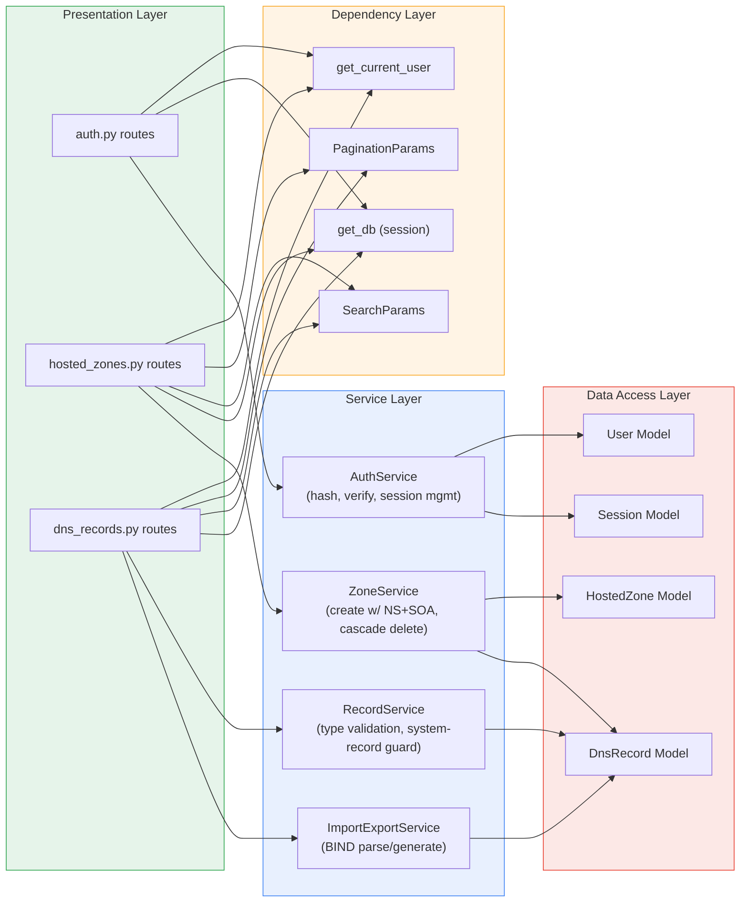
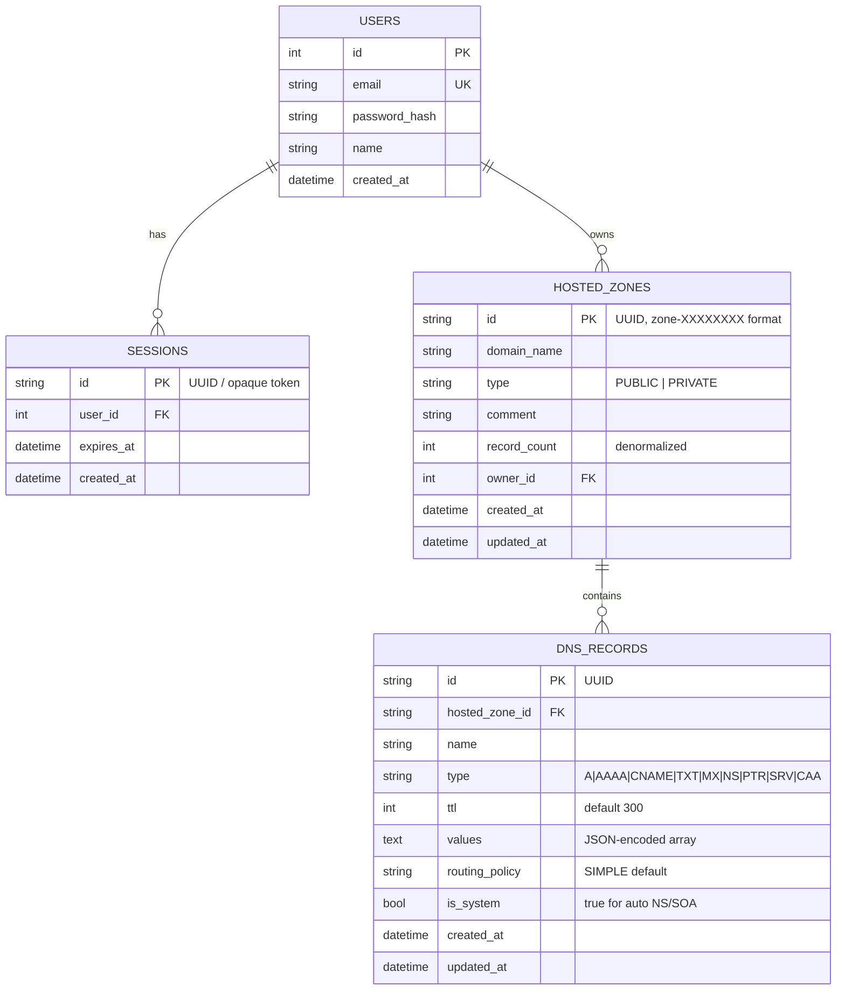
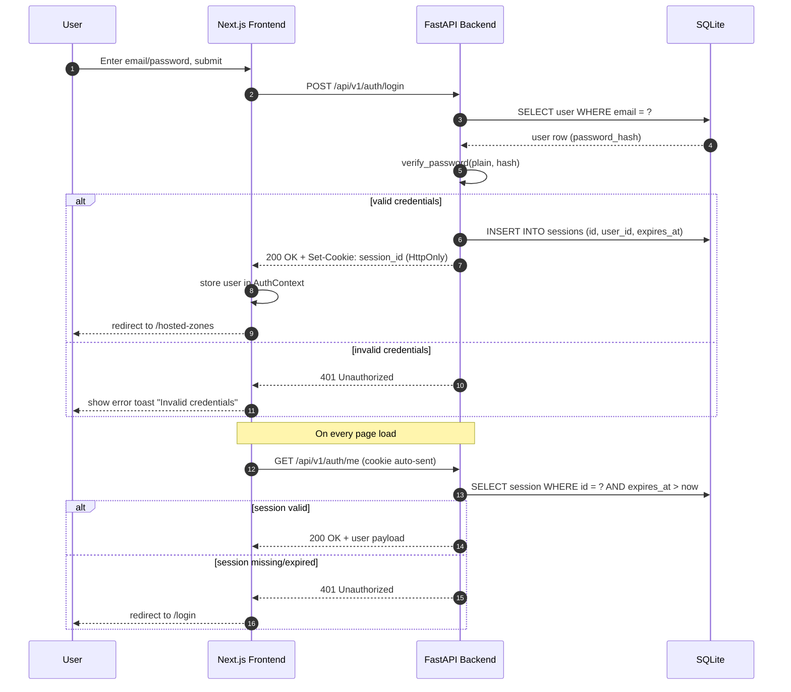
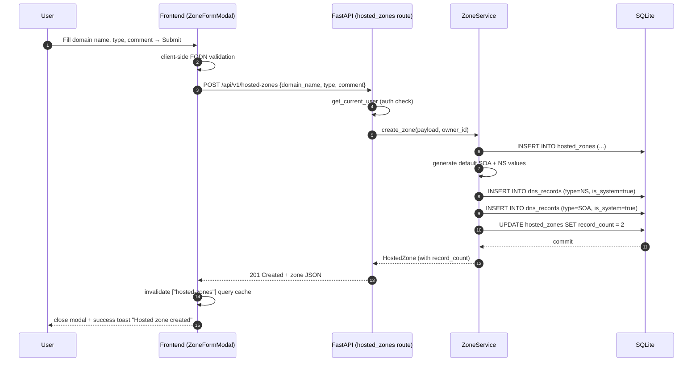
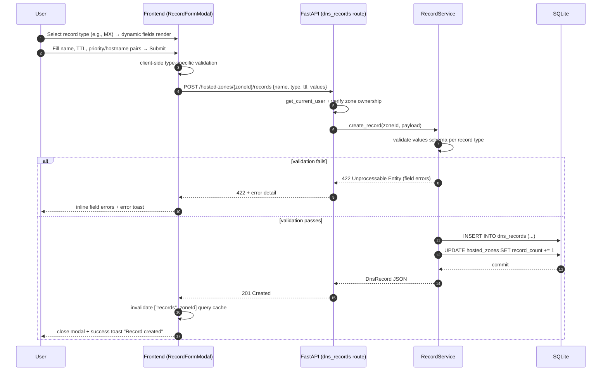
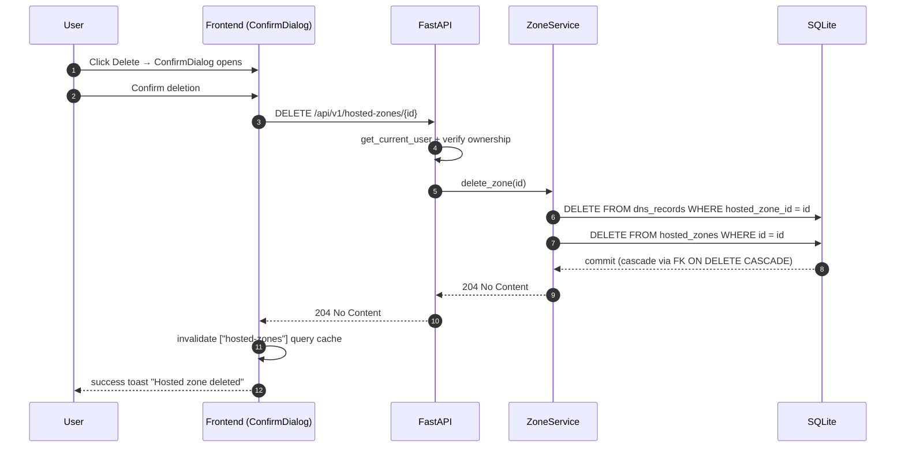
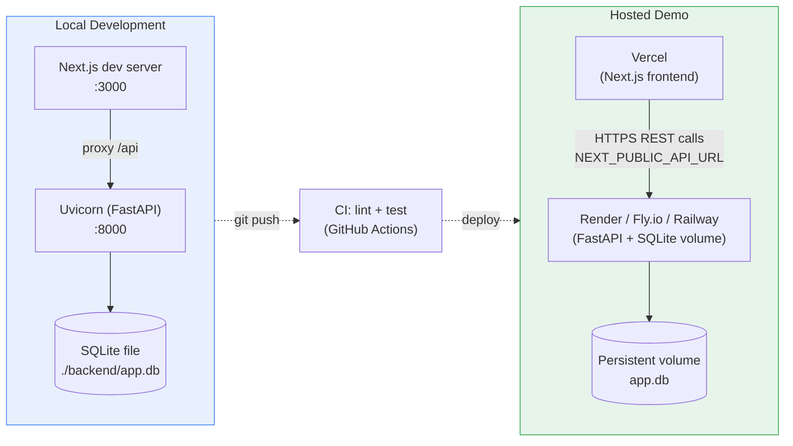

# Technical Design Document
## AWS Route53 Clone

| | |
|---|---|
| **Document Type** | Technical Design / Engineering Spec |
| **Companion Doc** | Route53-Clone-PRD.md |
| **Stack** | Next.js (TypeScript) · FastAPI (Python) · SQLite · SQLAlchemy |
| **Status** | Draft v1.0 |
| **Last Updated** | July 10, 2026 |

---

## 1. Purpose & Scope

This document translates the PRD into an implementable technical design: system architecture, component boundaries, data model, API contracts, request/response flows, folder structures, and operational concerns (auth, error handling, deployment). It is the primary reference for engineers building the frontend, backend, and database layers.

---

## 2. High-Level System Architecture



**Key architectural decisions**

| Decision | Rationale |
|---|---|
| REST (not GraphQL) | Matches Route53's own API style; simpler to mirror 1:1 in FastAPI's OpenAPI docs |
| Session cookie (HTTP-only) over localStorage JWT | Mitigates XSS token theft; simpler `credentials: 'include'` fetch pattern |
| TanStack Query for server-state | Avoids manual loading/error/cache boilerplate; supports optimistic updates for snappy CRUD |
| SQLAlchemy + SQLite | Zero-ops local persistence; ORM keeps a clean migration path to Postgres later |
| Service layer between routes and ORM | Isolates business rules (e.g., auto-generating NS/SOA records, system-record deletion guard) from HTTP concerns |

---

## 3. Component Architecture

### 3.1 Frontend Component Tree



### 3.2 Backend Layered Architecture



---

## 4. Data Model / Entity-Relationship Diagram



**Indexes**
- `hosted_zones(domain_name)` — unique-ish lookup + search
- `dns_records(hosted_zone_id, name, type)` — composite index for list/search/filter
- `sessions(user_id)` — fast session lookups on auth check

---

## 5. Key Request Flows (Sequence Diagrams)

### 5.1 Login & Session Persistence



### 5.2 Create Hosted Zone (with auto NS/SOA generation)



### 5.3 Create / Edit DNS Record (type-aware validation)



### 5.4 Delete Hosted Zone (cascade + system-record guard)



---

## 6. Frontend Design Details

### 6.1 Routing Map (Next.js App Router)

| Route | File | Auth Required | Description |
|---|---|---|---|
| `/login` | `app/(auth)/login/page.tsx` | No | Mock login form |
| `/hosted-zones` | `app/(dashboard)/hosted-zones/page.tsx` | Yes | Zones list (search/paginate) |
| `/hosted-zones/[id]` | `app/(dashboard)/hosted-zones/[id]/page.tsx` | Yes | Zone detail + records table |
| `/dashboard` | `app/(dashboard)/dashboard/page.tsx` | Yes | Coming Soon |
| `/traffic-policies` | `app/(dashboard)/traffic-policies/page.tsx` | Yes | Coming Soon |
| `/resolver` | `app/(dashboard)/resolver/page.tsx` | Yes | Coming Soon |
| `/health-checks` | `app/(dashboard)/health-checks/page.tsx` | Yes | Coming Soon |
| `/profiles` | `app/(dashboard)/profiles/page.tsx` | Yes | Coming Soon |

Route protection implemented via `middleware.ts`, checking the session cookie and redirecting unauthenticated requests to `/login`.

### 6.2 State Management Strategy

| State type | Tool | Example |
|---|---|---|
| Server state (remote data) | TanStack Query | zones list, records list, zone detail |
| Auth/session state | React Context (`AuthProvider`) | current user, login/logout actions |
| UI/local state | `useState` / `useReducer` | modal open/close, form field values, filters |
| Global UI feedback | Context (`ToastProvider`) | success/error/info notifications |

Query keys convention: `["hosted-zones", { q, page, pageSize }]`, `["records", zoneId, { q, type, page, pageSize }]` — enables targeted cache invalidation on mutation.

### 6.3 Shared Component Contracts (high level)

```typescript
// DataTable.tsx
interface DataTableProps<T> {
  columns: ColumnDef<T>[];
  data: T[];
  total: number;
  page: number;
  pageSize: number;
  isLoading: boolean;
  onPageChange: (page: number) => void;
  onSearch?: (query: string) => void;
  filters?: React.ReactNode; // e.g., record type filter
  rowActions?: (row: T) => React.ReactNode; // Edit/Delete menu
  onRowClick?: (row: T) => void;
}

// RecordFormModal.tsx
interface RecordFormModalProps {
  zoneId: string;
  mode: "create" | "edit";
  initialData?: DnsRecord;
  isOpen: boolean;
  onClose: () => void;
  onSuccess: () => void; // triggers query invalidation + toast
}
```

---

## 7. Backend Design Details

### 7.1 Pydantic Schema Examples

```python
# schemas/dns_record.py
from pydantic import BaseModel, field_validator
from typing import Literal, Union
from enum import Enum

class RecordType(str, Enum):
    A = "A"
    AAAA = "AAAA"
    CNAME = "CNAME"
    TXT = "TXT"
    MX = "MX"
    NS = "NS"
    PTR = "PTR"
    SRV = "SRV"
    CAA = "CAA"

class DnsRecordCreate(BaseModel):
    name: str
    type: RecordType
    ttl: int = 300
    values: list[str] | list[dict]  # dict form for MX/SRV/CAA structured values
    routing_policy: Literal["SIMPLE", "WEIGHTED"] = "SIMPLE"

    @field_validator("ttl")
    @classmethod
    def ttl_range(cls, v: int) -> int:
        if not (0 <= v <= 172800):
            raise ValueError("TTL must be between 0 and 172800 seconds")
        return v

class DnsRecordResponse(DnsRecordCreate):
    id: str
    hosted_zone_id: str
    is_system: bool
    created_at: str
    updated_at: str
```

### 7.2 Auth Dependency

```python
# api/deps.py
from fastapi import Depends, HTTPException, Cookie
from sqlalchemy.orm import Session

def get_db() -> Session: ...

def get_current_user(
    session_id: str | None = Cookie(default=None),
    db: Session = Depends(get_db),
) -> User:
    if not session_id:
        raise HTTPException(status_code=401, detail="Not authenticated")
    session = db.query(Session).filter_by(id=session_id).first()
    if not session or session.expires_at < now():
        raise HTTPException(status_code=401, detail="Session expired")
    return session.user
```

### 7.3 Pagination Envelope (all list endpoints)

```json
{
  "items": [ /* ... */ ],
  "total": 42,
  "page": 1,
  "page_size": 25
}
```

### 7.4 Error Response Convention

```json
{
  "detail": "Domain name already exists",
  "code": "DUPLICATE_ZONE",
  "field": "domain_name"
}
```
FastAPI's `HTTPException` used for standard errors; a custom `RequestValidationError` handler normalizes Pydantic 422 errors into the same envelope shape for consistent frontend toast/field-error handling.

---

## 8. Full Repository File Structure

```
route53-clone/
├── README.md
├── docker-compose.yml                     # optional: spin up FE+BE together
├── .gitignore
│
├── frontend/
│   ├── package.json
│   ├── tsconfig.json
│   ├── next.config.ts
│   ├── tailwind.config.ts
│   ├── middleware.ts                      # route protection
│   ├── .env.local.example
│   │
│   ├── app/
│   │   ├── layout.tsx                     # root layout (AuthProvider, ToastProvider)
│   │   ├── globals.css
│   │   │
│   │   ├── (auth)/
│   │   │   └── login/
│   │   │       └── page.tsx
│   │   │
│   │   └── (dashboard)/
│   │       ├── layout.tsx                 # SideNav + TopBar wrapper
│   │       ├── dashboard/
│   │       │   └── page.tsx               # Coming Soon
│   │       ├── hosted-zones/
│   │       │   ├── page.tsx               # zones list
│   │       │   └── [id]/
│   │       │       └── page.tsx           # zone detail + records
│   │       ├── traffic-policies/
│   │       │   └── page.tsx               # Coming Soon
│   │       ├── resolver/
│   │       │   └── page.tsx               # Coming Soon
│   │       ├── health-checks/
│   │       │   └── page.tsx               # Coming Soon
│   │       └── profiles/
│   │           └── page.tsx               # Coming Soon
│   │
│   ├── components/
│   │   ├── layout/
│   │   │   ├── SideNav.tsx
│   │   │   ├── TopBar.tsx
│   │   │   └── Breadcrumbs.tsx
│   │   ├── common/
│   │   │   ├── DataTable.tsx
│   │   │   ├── Pagination.tsx
│   │   │   ├── SearchBar.tsx
│   │   │   ├── Modal.tsx
│   │   │   ├── ConfirmDialog.tsx
│   │   │   ├── Toast.tsx
│   │   │   ├── ToastProvider.tsx
│   │   │   ├── Badge.tsx
│   │   │   └── ComingSoonPage.tsx
│   │   ├── zones/
│   │   │   ├── HostedZonesTable.tsx
│   │   │   ├── ZoneFormModal.tsx
│   │   │   └── ZoneHeader.tsx
│   │   └── records/
│   │       ├── RecordsTable.tsx
│   │       ├── RecordFormModal.tsx
│   │       ├── RecordTypeFields/          # dynamic per-type field groups
│   │       │   ├── AFields.tsx
│   │       │   ├── MxFields.tsx
│   │       │   ├── SrvFields.tsx
│   │       │   ├── CaaFields.tsx
│   │       │   └── ...
│   │       └── TypeFilter.tsx
│   │
│   ├── lib/
│   │   ├── api-client.ts                  # fetch wrapper, base URL, credentials
│   │   ├── query-keys.ts
│   │   └── validators.ts                  # zod schemas for forms
│   │
│   ├── hooks/
│   │   ├── useHostedZones.ts              # TanStack Query hooks
│   │   ├── useHostedZone.ts
│   │   ├── useDnsRecords.ts
│   │   └── useAuth.ts
│   │
│   ├── context/
│   │   ├── AuthContext.tsx
│   │   └── ToastContext.tsx
│   │
│   └── types/
│       ├── hosted-zone.ts
│       ├── dns-record.ts
│       └── user.ts
│
└── backend/
    ├── requirements.txt
    ├── pyproject.toml                     # or setup.cfg (ruff/black config)
    ├── .env.example
    ├── alembic.ini                        # optional migrations
    │
    ├── app/
    │   ├── main.py                        # FastAPI() app, CORS, router includes
    │   │
    │   ├── core/
    │   │   ├── config.py                  # Settings (pydantic-settings)
    │   │   ├── security.py                # password hashing, session tokens
    │   │   └── database.py                # engine, SessionLocal, Base
    │   │
    │   ├── models/
    │   │   ├── user.py
    │   │   ├── session.py
    │   │   ├── hosted_zone.py
    │   │   └── dns_record.py
    │   │
    │   ├── schemas/
    │   │   ├── auth.py
    │   │   ├── hosted_zone.py
    │   │   ├── dns_record.py
    │   │   └── common.py                  # PaginatedResponse, ErrorResponse
    │   │
    │   ├── api/
    │   │   ├── deps.py                    # get_db, get_current_user, pagination
    │   │   └── v1/
    │   │       ├── router.py              # aggregates all route modules
    │   │       ├── auth.py
    │   │       ├── hosted_zones.py
    │   │       └── dns_records.py
    │   │
    │   ├── services/
    │   │   ├── auth_service.py
    │   │   ├── zone_service.py            # incl. default NS/SOA generation
    │   │   ├── record_service.py          # type validation, system guard
    │   │   └── import_export_service.py   # BIND zone file parse/generate
    │   │
    │   └── seed.py                        # seeds demo user + sample zones/records
    │
    ├── alembic/
    │   └── versions/
    │
    └── tests/
        ├── conftest.py
        ├── test_auth.py
        ├── test_hosted_zones.py
        └── test_dns_records.py
```

---

## 9. Deployment Architecture



**Notes**
- SQLite requires a persistent disk/volume on the hosting platform (ephemeral filesystems will lose data on redeploy) — Render/Fly.io persistent volumes recommended over serverless platforms for the backend.
- CORS on FastAPI restricted to the deployed frontend origin; cookies set with `SameSite=None; Secure` in production for cross-origin auth to work.

---

## 10. Technology Stack Summary

| Layer | Technology | Purpose |
|---|---|---|
| Frontend framework | Next.js 14+ (App Router), TypeScript | SSR/CSR hybrid, typed React |
| Styling | Tailwind CSS (+ shadcn/ui) | AWS-console-like density and theming |
| Server-state | TanStack Query | Caching, mutations, invalidation |
| Form validation | react-hook-form + zod | Type-safe, per-record-type schemas |
| Backend framework | FastAPI | Async, OpenAPI docs, Pydantic validation |
| ORM | SQLAlchemy 2.0 | Models, relationships, cascade rules |
| Migrations | Alembic (optional but recommended) | Versioned schema changes |
| Database | SQLite | Zero-ops persistence per PRD requirement |
| Auth | Passlib (bcrypt) + HttpOnly session cookie | Mocked but realistic auth |
| Testing | Pytest (backend), Vitest/Playwright (frontend) | Unit + E2E coverage |
| Lint/format | ESLint/Prettier, ruff/black | Code quality gates |

---

## 11. Cross-Cutting Concerns

### 11.1 Validation Strategy
- **Frontend**: zod schemas per record type gate form submission before any network call (fast feedback).
- **Backend**: Pydantic schemas + custom `field_validator`s are the source of truth; frontend validation is a UX convenience, not a security boundary.

### 11.2 System-Managed Records
- NS and SOA records created at zone creation carry `is_system = true`.
- `RecordService.delete_record` raises `403` if `is_system` is true and the record is at the zone apex, matching Route53's real restriction; UI disables the delete action with a tooltip explanation.

### 11.3 Notifications
- All mutation hooks (`useCreateZone`, `useUpdateRecord`, etc.) follow a consistent pattern: `onSuccess` → invalidate relevant query key + push success toast; `onError` → push error toast with the backend's `detail` message.

### 11.4 Testing Strategy

| Layer | Type | Coverage target |
|---|---|---|
| Backend services | Unit tests (pytest) | Zone creation (NS/SOA), record type validation, cascade delete, system-record guard |
| Backend routes | Integration tests (pytest + TestClient) | Auth flow, CRUD status codes, pagination/search params |
| Frontend components | Unit tests (Vitest + Testing Library) | DataTable pagination/search, form validation per record type |
| End-to-end | Playwright | Login → create zone → create record → edit → delete happy path |

---

## 12. Open Questions / Decisions for Implementation

| Question | Recommendation |
|---|---|
| JWT vs server-tracked session table? | Server-tracked session table (simpler revocation on logout, matches `sessions` table in schema) |
| Zone ID format | Mimic Route53's `/hostedzone/XXXXXXXXXXXXX` style ID for authenticity in UI, store as plain UUID internally |
| Weighted routing policy | Implement as stretch goal; default all records to `SIMPLE` for MVP |
| BIND import conflict handling | On duplicate name+type, prompt user to overwrite or skip per record |
